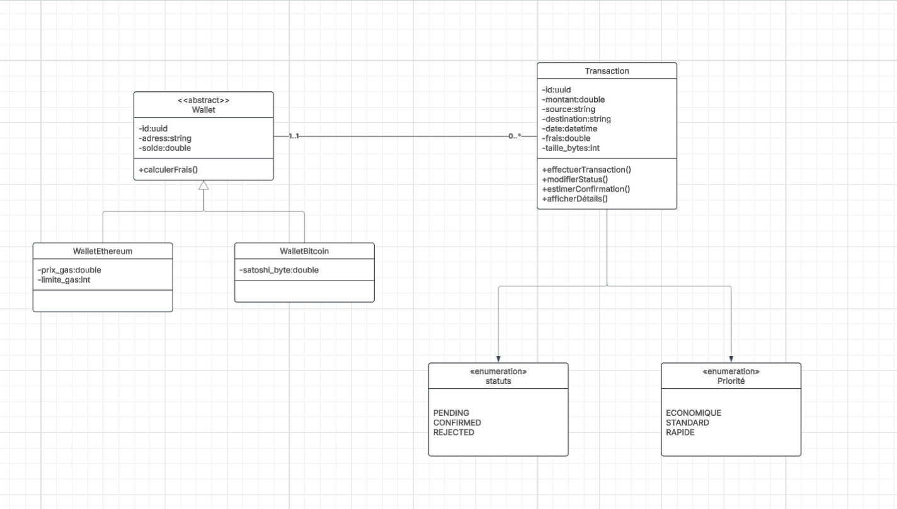

# Crypto Wallet Simulator

## Description du projet

Ce projet s'agit d'une application console en Java 8 simulant un portefeuille de cryptomonnaies (wallet) avec un mempool pour optimiser les frais de transaction (fees). Dans l'écosystème des cryptomonnaies comme Bitcoin et Ethereum, les transactions nécessitent des frais variables en fonction de la congestion du réseau et de la priorité choisie. L'application permet aux utilisateurs de créer un wallet, de générer des transactions, de calculer leur position dans le mempool, et de comparer les niveaux de frais (ÉCONOMIQUE, STANDARD, RAPIDE) pour estimer le temps de confirmation.

Les fonctionnalités principales incluent :
- Création de wallets pour Bitcoin ou Ethereum avec adresses uniques.
- Création de transactions avec calcul automatique des frais selon le type de crypto et la priorité.
- Simulation du mempool avec transactions aléatoires pour visualiser la position et le temps d'attente estimé (position × 10 minutes).
- Consultation de l'état du mempool, incluant la transaction de l'utilisateur.

Le projet respecte les principes SOLID, utilise des design patterns comme Singleton et Repository, et intègre une persistance en base de données PostgreSQL via JDBC. Il est conçu pour être modulaire, avec une séparation claire des couches (présentation, métier, données, utilitaire).

**Objectifs pédagogiques** : Maîtriser Java 8 (Stream API, Java Time API, enums), gestion de projet (Git, JIRA), bonnes pratiques (logging, validations, tests unitaires optionnels), et éviter les anti-patterns.

## Technologies utilisées

- **Langage** : Java 8 .
- **Base de données** : PostgreSQL .
- **Outils de développement** :
  - Eclipse
  - Gestion de version : Git (branches multiples).
  - Planification : JIRA.
- **Design Patterns** : Singleton (pour mempool ou logger), Repository Pattern (accès données).
- **Autres** : Enums pour statuts, priorités, types ; Stream API (map, filter, reduce, Optional) .

## Structure du projet

Le projet suit une architecture en couches pour respecter SOLID .


## Prérequis et installation

### Prérequis
- JDK 8 installé (vérifiez avec `java -version` – doit être 1.8.x).
- PostgreSQL 16+ installé et lancé (port 5432 par défaut).
- Git installé pour cloner le repo.
- IDE : Eclipse .

### Installation
1. Clonez le repository GitHub :
   ```
   git clone https://github.com/amhine/wallet_java.git
  
   ```
2. Configurez la base de données :
   - Créez une DB PostgreSQL nommée `wallet_java`.
   - Exécutez le script SQL :
     ```CREATE TABLE Wallet (
    id CHAR(25) PRIMARY KEY,
    address VARCHAR(255) NOT NULL,
    solde DOUBLE NOT NULL DEFAULT 0
);

CREATE TABLE WalletBitcoin (
   wallet_id CHAR(25) PRIMARY KEY,
   satoshi_byte DOUBLE NOT NULL,
   CONSTRAINT fk_wallet_bitcoin FOREIGN KEY (wallet_id) REFERENCES Wallet(id) ON DELETE CASCADE
);

CREATE TABLE WalletEthereum (
    wallet_id CHAR(25) PRIMARY KEY,
    prix_gas DOUBLE NOT NULL,
    limite_gas INT NOT NULL,
    CONSTRAINT fk_wallet_ethereum FOREIGN KEY (wallet_id) REFERENCES Wallet(id) ON DELETE CASCADE
);

CREATE TABLE Transaction (
    id CHAR(25) PRIMARY KEY,
    wallet_id CHAR(25) NOT NULL,
    montant DOUBLE NOT NULL,
    source VARCHAR(255) NOT NULL,
    destination VARCHAR(255) NOT NULL,
    datee DATETIME NOT NULL,
    frais DOUBLE NOT NULL,
    taille_bytes INT NOT NULL,
    priority ENUM('ECONOMIQUE', 'STANDARD', 'RAPIDE') NOT NULL DEFAULT 'STANDARD',
    status ENUM('PENDING', 'CONFIRMED', 'REJECTED') NOT NULL DEFAULT 'PENDING',
    CONSTRAINT fk_transaction_wallet FOREIGN KEY (wallet_id) REFERENCES Wallet(id) ON DELETE CASCADE
);
     
     ```
  

   ```

## Guide d'utilisation

 **Menu principal**  :
   ```
  === MENU ===
1. Créer un wallet
2. Créer une transaction
3. Vérifier une transaction
4. Comparer les frais
5. Voir l'état du mempool
0. Quitter
Votre choix : 
   ```

  **Fonctionnalités détaillées** :
   - **1. Créer un wallet** : Choisissez BITCOIN ou ETHEREUM → Adresse générée auto (ex. : bc1... pour BTC, 0x... pour ETH) → Solde initial 0.
   - **2. Créer une transaction** : Saisissez source/dest/montant → Choisissez fee level → Validations (montant >0, adresses valides) → Frais calculés (ex. BTC : taille bytes × sat/byte ; ETH : gas limit × gas price) → Statut PENDING, UUID généré.
   - **3. Position mempool** : Affiche "Votre transaction est en position X sur Y" + temps estimé (X × 10 min).
   - **4. Comparer fees** : Tableau ASCII exemple :
     ```
     ┌──────────────┬──────────┬─────────────┬─────────────────┐
     │ Fee Level    │ Frais $  │ Position    │ Temps estimé    │
     ├──────────────┼──────────┼─────────────┼─────────────────┤
     │ ÉCONOMIQUE   │ 1.50     │ 15/20       │ 150 min         │
     │ STANDARD     │ 5.00     │ 8/20        │ 80 min          │
     │ RAPIDE       │ 12.00    │ 2/20        │ 20 min          │
     └──────────────┴──────────┴─────────────┴─────────────────┘
     ```
   - **5. État mempool** : Génère 10-20 tx aléatoires → Affiche tableau trié par fees (votre tx mise en évidence).


## Captures d'écran


